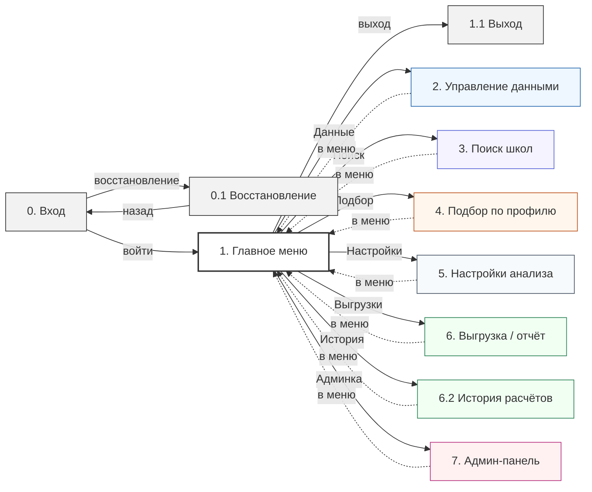

# Рисунок З.1 – Диаграмма переходов: вход, восстановление доступа и главное меню

```mermaid
---
config:
  layout: dagre
  flowchart:
    nodeSpacing: 15
    rankSpacing: 25
---

flowchart LR
  LoginForm["0. Вход"]
  RecoveryForm["0.1 Восстановление"]
  MainForm["1. Главное меню"]
  ExitForm["1.1 Выход"]

  DataMgmtForm["2. Управление данными"]
  SearchForm["3. Поиск школ"]
  ProfileSelection["4. Подбор по профилю"]
  SettingsForm["5. Настройки анализа"]
  ReportGenerate["6. Выгрузка / отчёт"]
  CalcHistory["6.2 История расчётов"]
  AdminPanel["7. Админ-панель"]

  LoginForm -->|войти| MainForm
  LoginForm -->|восстановление| RecoveryForm
  RecoveryForm -->|назад| LoginForm
  MainForm -->|выход| ExitForm

  MainForm -->|Данные| DataMgmtForm
  MainForm -->|Поиск| SearchForm
  MainForm -->|Подбор| ProfileSelection
  MainForm -->|Настройки| SettingsForm
  MainForm -->|Выгрузки| ReportGenerate
  MainForm -->|История| CalcHistory
  MainForm -->|Админка| AdminPanel

  DataMgmtForm -.->|в меню| MainForm
  SearchForm -.->|в меню| MainForm
  ProfileSelection -.->|в меню| MainForm
  SettingsForm -.->|в меню| MainForm
  ReportGenerate -.->|в меню| MainForm
  CalcHistory -.->|в меню| MainForm
  AdminPanel -.->|в меню| MainForm

  %% ====== Стили ======
  classDef auth fill:#f2f2f2,stroke:#333,stroke-width:1px;
  classDef main fill:#ffffff,stroke:#333,stroke-width:2px;
  classDef data fill:#eef7ff,stroke:#2b6cb0,stroke-width:1px;
  classDef search fill:#f5f3ff,stroke:#5a67d8,stroke-width:1px;
  classDef rating fill:#fff7ed,stroke:#c05621,stroke-width:1px;
  classDef set fill:#f7fafc,stroke:#4a5568,stroke-width:1px;
  classDef rep fill:#f1fff3,stroke:#2f855a,stroke-width:1px;
  classDef adm fill:#fff1f2,stroke:#b83280,stroke-width:1px;

  class LoginForm,RecoveryForm,ExitForm auth;
  class MainForm main;
  class DataMgmtForm data;
  class SearchForm search;
  class ProfileSelection rating;
  class SettingsForm set;
  class ReportGenerate,CalcHistory rep;
  class AdminPanel adm;
```
