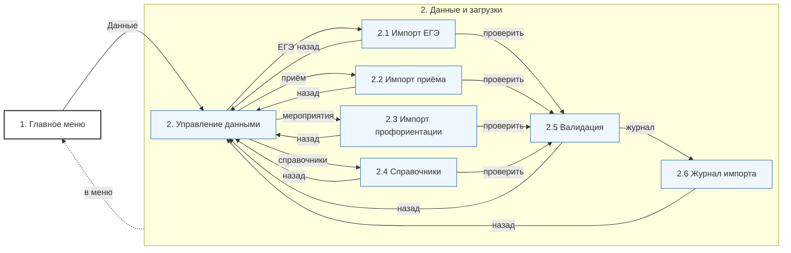

# Рисунок З.2 – Диаграмма переходов в разделе «Данные и загрузки»

```mermaid
---
config:
  layout: dagre
  flowchart:
    nodeSpacing: 15
    rankSpacing: 25
---

flowchart LR
  MainForm["1. Главное меню"]

  subgraph DATA["2. Данные и загрузки"]
    direction TB
    DataMgmtForm["2. Управление данными"]
    LoadEGE["2.1 Импорт ЕГЭ"]
    Admissions["2.2 Импорт приёма"]
    EventsForm["2.3 Импорт профориентации"]
    Directories["2.4 Справочники"]
    ValidationForm["2.5 Валидация"]
    HistoryForm["2.6 Журнал импорта"]

    DataMgmtForm -->|ЕГЭ| LoadEGE
    DataMgmtForm -->|приём| Admissions
    DataMgmtForm -->|мероприятия| EventsForm
    DataMgmtForm -->|справочники| Directories

    LoadEGE -->|проверить| ValidationForm
    Admissions -->|проверить| ValidationForm
    EventsForm -->|проверить| ValidationForm
    Directories -->|проверить| ValidationForm

    ValidationForm -->|журнал| HistoryForm

    LoadEGE -->|назад| DataMgmtForm
    Admissions -->|назад| DataMgmtForm
    EventsForm -->|назад| DataMgmtForm
    Directories -->|назад| DataMgmtForm
    ValidationForm -->|назад| DataMgmtForm
    HistoryForm -->|назад| DataMgmtForm
  end

  MainForm -->|Данные| DataMgmtForm
  DATA -.->|в меню| MainForm

  %% ====== Стили ======
  classDef auth fill:#f2f2f2,stroke:#333,stroke-width:1px;
  classDef main fill:#ffffff,stroke:#333,stroke-width:2px;
  classDef data fill:#eef7ff,stroke:#2b6cb0,stroke-width:1px;
  classDef search fill:#f5f3ff,stroke:#5a67d8,stroke-width:1px;
  classDef rating fill:#fff7ed,stroke:#c05621,stroke-width:1px;
  classDef set fill:#f7fafc,stroke:#4a5568,stroke-width:1px;
  classDef rep fill:#f1fff3,stroke:#2f855a,stroke-width:1px;
  classDef adm fill:#fff1f2,stroke:#b83280,stroke-width:1px;

  class MainForm main;
  class DataMgmtForm,LoadEGE,Admissions,EventsForm,Directories,ValidationForm,HistoryForm data;
```
