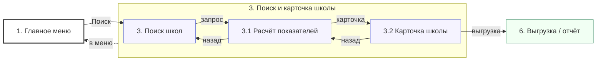

# Рисунок З.3 – Диаграмма переходов в разделе «Поиск и карточка школы»

```mermaid
---
config:
  layout: dagre
  flowchart:
    nodeSpacing: 15
    rankSpacing: 25
---

flowchart LR
  MainForm["1. Главное меню"]
  ReportGenerate["6. Выгрузка / отчёт"]

  subgraph SEARCH["3. Поиск и карточка школы"]
    direction TB
    SearchForm["3. Поиск школ"]
    CalculationForm["3.1 Расчёт показателей"]
    SchoolCard["3.2 Карточка школы"]

    SearchForm -->|запрос| CalculationForm
    CalculationForm -->|карточка| SchoolCard

    CalculationForm -->|назад| SearchForm
    SchoolCard -->|назад| CalculationForm
  end

  MainForm -->|Поиск| SearchForm
  SchoolCard -->|выгрузка| ReportGenerate
  SEARCH -.->|в меню| MainForm

  %% ====== Стили ======
  classDef auth fill:#f2f2f2,stroke:#333,stroke-width:1px;
  classDef main fill:#ffffff,stroke:#333,stroke-width:2px;
  classDef data fill:#eef7ff,stroke:#2b6cb0,stroke-width:1px;
  classDef search fill:#f5f3ff,stroke:#5a67d8,stroke-width:1px;
  classDef rating fill:#fff7ed,stroke:#c05621,stroke-width:1px;
  classDef set fill:#f7fafc,stroke:#4a5568,stroke-width:1px;
  classDef rep fill:#f1fff3,stroke:#2f855a,stroke-width:1px;
  classDef adm fill:#fff1f2,stroke:#b83280,stroke-width:1px;

  class MainForm main;
  class SearchForm,CalculationForm,SchoolCard search;
  class ReportGenerate rep;
```
