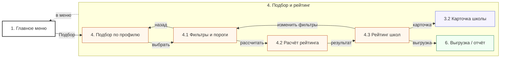

# Рисунок З.4 – Диаграмма переходов в разделе «Подбор и рейтинг школ»

```mermaid
---
config:
  layout: dagre
  flowchart:
    nodeSpacing: 15
    rankSpacing: 25
---

flowchart LR
  MainForm["1. Главное меню"]
  SchoolCard["3.2 Карточка школы"]
  ReportGenerate["6. Выгрузка / отчёт"]

  subgraph RATING["4. Подбор и рейтинг"]
    direction TB
    ProfileSelection["4. Подбор по профилю"]
    ProfileFilterSettings["4.1 Фильтры и пороги"]
    RatingCalculation["4.2 Расчёт рейтинга"]
    RatingList["4.3 Рейтинг школ"]

    ProfileSelection -->|выбрать| ProfileFilterSettings
    ProfileFilterSettings -->|рассчитать| RatingCalculation
    RatingCalculation -->|результат| RatingList

    RatingList -->|карточка| SchoolCard
    RatingList -->|выгрузка| ReportGenerate
    RatingList -->|изменить фильтры| ProfileFilterSettings
    ProfileFilterSettings -->|назад| ProfileSelection
  end

  MainForm -->|Подбор| ProfileSelection
  RATING -.->|в меню| MainForm

  %% ====== Стили ======
  classDef auth fill:#f2f2f2,stroke:#333,stroke-width:1px;
  classDef main fill:#ffffff,stroke:#333,stroke-width:2px;
  classDef data fill:#eef7ff,stroke:#2b6cb0,stroke-width:1px;
  classDef search fill:#f5f3ff,stroke:#5a67d8,stroke-width:1px;
  classDef rating fill:#fff7ed,stroke:#c05621,stroke-width:1px;
  classDef set fill:#f7fafc,stroke:#4a5568,stroke-width:1px;
  classDef rep fill:#f1fff3,stroke:#2f855a,stroke-width:1px;
  classDef adm fill:#fff1f2,stroke:#b83280,stroke-width:1px;

  class MainForm main;
  class ProfileSelection,ProfileFilterSettings,RatingCalculation,RatingList rating;
  class SchoolCard search;
  class ReportGenerate rep;
```
