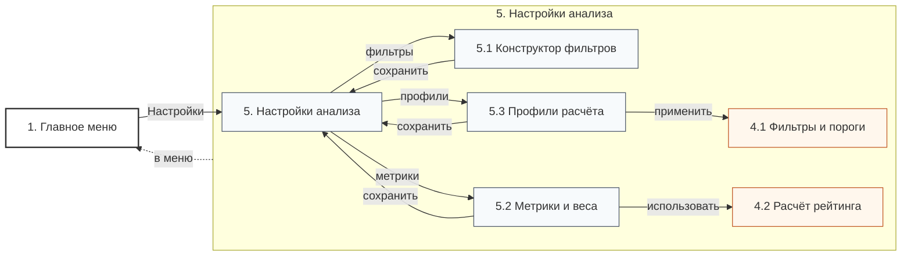

# Рисунок З.5 – Диаграмма переходов в разделе «Настройки анализа»

```mermaid
---
config:
  layout: dagre
  flowchart:
    nodeSpacing: 15
    rankSpacing: 25
---

flowchart LR
  MainForm["1. Главное меню"]
  ProfileFilterSettings["4.1 Фильтры и пороги"]
  RatingCalculation["4.2 Расчёт рейтинга"]

  subgraph SETTINGS["5. Настройки анализа"]
    direction TB
    SettingsForm["5. Настройки анализа"]
    GlobalFilters["5.1 Конструктор фильтров"]
    Weights["5.2 Метрики и веса"]
    ProfilesForm["5.3 Профили расчёта"]

    SettingsForm -->|фильтры| GlobalFilters
    SettingsForm -->|метрики| Weights
    SettingsForm -->|профили| ProfilesForm

    GlobalFilters -->|сохранить| SettingsForm
    Weights -->|сохранить| SettingsForm
    ProfilesForm -->|сохранить| SettingsForm

    ProfilesForm -->|применить| ProfileFilterSettings
    Weights -->|использовать| RatingCalculation
  end

  MainForm -->|Настройки| SettingsForm
  SETTINGS -.->|в меню| MainForm

  %% ====== Стили ======
  classDef auth fill:#f2f2f2,stroke:#333,stroke-width:1px;
  classDef main fill:#ffffff,stroke:#333,stroke-width:2px;
  classDef data fill:#eef7ff,stroke:#2b6cb0,stroke-width:1px;
  classDef search fill:#f5f3ff,stroke:#5a67d8,stroke-width:1px;
  classDef rating fill:#fff7ed,stroke:#c05621,stroke-width:1px;
  classDef set fill:#f7fafc,stroke:#4a5568,stroke-width:1px;
  classDef rep fill:#f1fff3,stroke:#2f855a,stroke-width:1px;
  classDef adm fill:#fff1f2,stroke:#b83280,stroke-width:1px;

  class MainForm main;
  class SettingsForm,GlobalFilters,Weights,ProfilesForm set;
  class ProfileFilterSettings,RatingCalculation rating;
```
