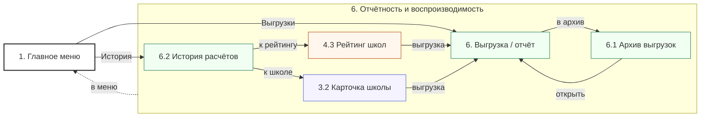

# Рисунок З.6 – Диаграмма переходов в разделе «Отчётность и воспроизводимость»

```mermaid
---
config:
  layout: dagre
  flowchart:
    nodeSpacing: 15
    rankSpacing: 25
---

flowchart LR
  MainForm["1. Главное меню"]
  SchoolCard["3.2 Карточка школы"]
  RatingList["4.3 Рейтинг школ"]

  subgraph REPORTS["6. Отчётность и воспроизводимость"]
    direction TB
    ReportGenerate["6. Выгрузка / отчёт"]
    ReportArchive["6.1 Архив выгрузок"]
    CalcHistory["6.2 История расчётов"]

    SchoolCard -->|выгрузка| ReportGenerate
    RatingList -->|выгрузка| ReportGenerate

    ReportGenerate -->|в архив| ReportArchive
    ReportArchive -->|открыть| ReportGenerate

    CalcHistory -->|к рейтингу| RatingList
    CalcHistory -->|к школе| SchoolCard
  end

  MainForm -->|Выгрузки| ReportGenerate
  MainForm -->|История| CalcHistory
  REPORTS -.->|в меню| MainForm

  %% ====== Стили ======
  classDef auth fill:#f2f2f2,stroke:#333,stroke-width:1px;
  classDef main fill:#ffffff,stroke:#333,stroke-width:2px;
  classDef data fill:#eef7ff,stroke:#2b6cb0,stroke-width:1px;
  classDef search fill:#f5f3ff,stroke:#5a67d8,stroke-width:1px;
  classDef rating fill:#fff7ed,stroke:#c05621,stroke-width:1px;
  classDef set fill:#f7fafc,stroke:#4a5568,stroke-width:1px;
  classDef rep fill:#f1fff3,stroke:#2f855a,stroke-width:1px;
  classDef adm fill:#fff1f2,stroke:#b83280,stroke-width:1px;

  class MainForm main;
  class ReportGenerate,ReportArchive,CalcHistory rep;
  class SchoolCard search;
  class RatingList rating;
```
