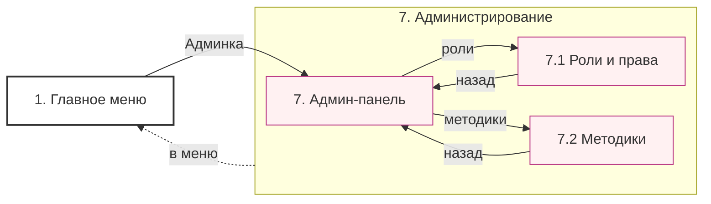

# Рисунок З.7 – Диаграмма переходов в разделе «Администрирование»

```mermaid
---
config:
  layout: dagre
  flowchart:
    nodeSpacing: 15
    rankSpacing: 25
---

flowchart LR
  MainForm["1. Главное меню"]

  subgraph ADMIN["7. Администрирование"]
    direction TB
    AdminPanel["7. Админ-панель"]
    Roles["7.1 Роли и права"]
    Methodologies["7.2 Методики"]

    AdminPanel -->|роли| Roles
    AdminPanel -->|методики| Methodologies

    Roles -->|назад| AdminPanel
    Methodologies -->|назад| AdminPanel
  end

  MainForm -->|Админка| AdminPanel
  ADMIN -.->|в меню| MainForm

  %% ====== Стили ======
  classDef auth fill:#f2f2f2,stroke:#333,stroke-width:1px;
  classDef main fill:#ffffff,stroke:#333,stroke-width:2px;
  classDef data fill:#eef7ff,stroke:#2b6cb0,stroke-width:1px;
  classDef search fill:#f5f3ff,stroke:#5a67d8,stroke-width:1px;
  classDef rating fill:#fff7ed,stroke:#c05621,stroke-width:1px;
  classDef set fill:#f7fafc,stroke:#4a5568,stroke-width:1px;
  classDef rep fill:#f1fff3,stroke:#2f855a,stroke-width:1px;
  classDef adm fill:#fff1f2,stroke:#b83280,stroke-width:1px;

  class MainForm main;
  class AdminPanel,Roles,Methodologies adm;
```
