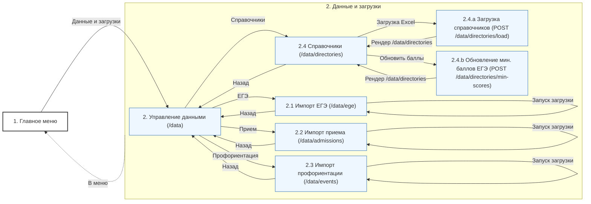
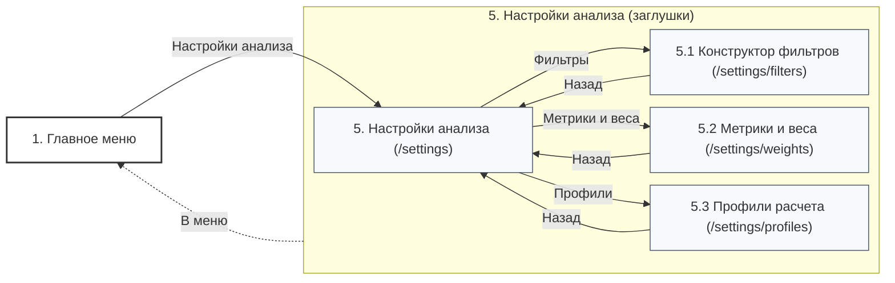
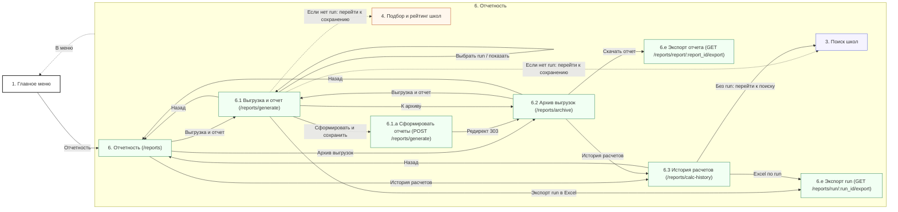
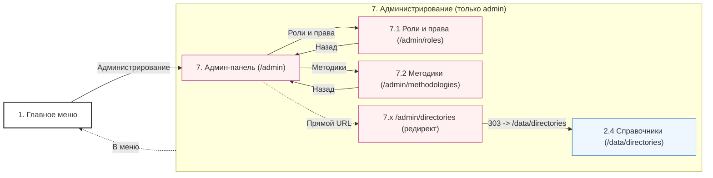

# Диаграмма переходов: вход, восстановление доступа и главное меню

```mermaid
---
config:
  layout: dagre
  flowchart:
    nodeSpacing: 15
    rankSpacing: 25
---

flowchart LR
  LoginForm["0. Вход (/login)"]
  RecoveryForm["0.1 Восстановление доступа (/recovery)"]
  MainForm["1. Главное меню (/)"]
  LogoutAction["1.1 Выход (/logout)"]

  DataMgmtForm["2. Данные и загрузки (/data)"]
  SearchForm["3. Поиск школ (/search)"]
  RatingForm["4. Подбор и рейтинг школ (/rating/profile)"]
  SettingsForm["5. Настройки анализа (/settings)"]
  ReportsHome["6. Отчетность (/reports)"]
  AdminPanel["7. Администрирование (/admin, только admin)"]

  LoginForm -->|POST /login| MainForm
  LoginForm -->|Восстановление| RecoveryForm
  RecoveryForm -->|Назад| LoginForm
  MainForm -->|Выход| LogoutAction
  LogoutAction -->|Редирект 303| LoginForm

  MainForm -->|Раздел| DataMgmtForm
  MainForm -->|Раздел| SearchForm
  MainForm -->|Раздел| RatingForm
  MainForm -->|Раздел| SettingsForm
  MainForm -->|Раздел| ReportsHome
  MainForm -->|Раздел (если admin)| AdminPanel

  DataMgmtForm -.->|В меню| MainForm
  SearchForm -.->|В меню| MainForm
  RatingForm -.->|В меню| MainForm
  SettingsForm -.->|В меню| MainForm
  ReportsHome -.->|В меню| MainForm
  AdminPanel -.->|В меню| MainForm

  classDef auth fill:#f2f2f2,stroke:#333,stroke-width:1px;
  classDef main fill:#ffffff,stroke:#333,stroke-width:2px;
  classDef data fill:#eef7ff,stroke:#2b6cb0,stroke-width:1px;
  classDef search fill:#f5f3ff,stroke:#5a67d8,stroke-width:1px;
  classDef rating fill:#fff7ed,stroke:#c05621,stroke-width:1px;
  classDef set fill:#f7fafc,stroke:#4a5568,stroke-width:1px;
  classDef rep fill:#f1fff3,stroke:#2f855a,stroke-width:1px;
  classDef adm fill:#fff1f2,stroke:#b83280,stroke-width:1px;

  class LoginForm,RecoveryForm,LogoutAction auth;
  class MainForm main;
  class DataMgmtForm data;
  class SearchForm search;
  class RatingForm rating;
  class SettingsForm set;
  class ReportsHome rep;
  class AdminPanel adm;
```

---

# Диаграмма переходов в разделе «Данные и загрузки»



---

# Диаграмма переходов в разделе «Поиск школ и карточка школы»

```mermaid
---
config:
  layout: dagre
  flowchart:
    nodeSpacing: 15
    rankSpacing: 25
---

flowchart LR
  MainForm["1. Главное меню"]
  ReportsHome["6. Отчетность (/reports)"]

  subgraph SEARCH["3. Поиск школ и карточка школы"]
    direction TB
    SearchForm["3. Поиск школ (/search)"]
    SaveSearchAction["3.s Сохранить результат (POST /search/save)"]
    SearchExport["3.e Экспорт списка (GET /search/export)"]
    SchoolCard["3.1 Карточка школы (/search/school/:school_id)"]
    SchoolCardExport["3.1.e Экспорт карточки (GET /search/school/:school_id/export)"]
    MunicipalitiesApi["3.api Муниципалитеты (GET /search/municipalities)"]

    SearchForm -->|Фильтры (POST /search)| SearchForm
    SearchForm -->|Сохранить результат| SaveSearchAction
    SaveSearchAction -->|Редирект 303 с save_status| SearchForm
    SearchForm -->|Экспорт Excel| SearchExport
    SearchForm -->|Открыть карточку| SchoolCard
    SearchForm -->|AJAX по региону| MunicipalitiesApi

    SchoolCard -->|Экспорт карточки| SchoolCardExport
    SchoolCard -->|Назад к поиску| SearchForm
    SchoolCard -->|Выгрузка и отчет| ReportsHome
  end

  MainForm -->|Поиск школ| SearchForm
  SEARCH -.->|В меню| MainForm

  classDef main fill:#ffffff,stroke:#333,stroke-width:2px;
  classDef search fill:#f5f3ff,stroke:#5a67d8,stroke-width:1px;
  classDef rep fill:#f1fff3,stroke:#2f855a,stroke-width:1px;

  class MainForm main;
  class SearchForm,SaveSearchAction,SearchExport,SchoolCard,SchoolCardExport,MunicipalitiesApi search;
  class ReportsHome rep;
```

---

# Диаграмма переходов в разделе «Подбор и рейтинг школ»

```mermaid
---
config:
  layout: dagre
  flowchart:
    nodeSpacing: 15
    rankSpacing: 25
---

flowchart LR
  MainForm["1. Главное меню"]
  ReportsHome["6. Отчетность (/reports)"]

  subgraph RATING["4. Подбор и рейтинг школ"]
    direction TB
    RatingProfile["4. Подбор и рейтинг (/rating/profile)"]
    RatingSaveAction["4.s Сохранить рейтинг (POST /rating/profile/save)"]
    RatingExport["4.e Экспорт рейтинга (GET /rating/export)"]
    ProgramsApi["4.api Направления по институтам (GET /rating/programs)"]
    SchoolCardFromRating["3.1 Карточка школы (/search/school/:school_id?src=rating)"]

    RatingProfile -->|Расчет по параметрам| RatingProfile
    RatingProfile -->|Сохранить рейтинг| RatingSaveAction
    RatingSaveAction -->|Редирект 303 с save_status| RatingProfile
    RatingProfile -->|Экспорт Excel| RatingExport
    RatingProfile -->|AJAX: обновить направления| ProgramsApi

    RatingProfile -->|Карточка школы| SchoolCardFromRating
    SchoolCardFromRating -->|Назад (src=rating)| RatingProfile
    SchoolCardFromRating -->|Выгрузка и отчет| ReportsHome
  end

  MainForm -->|Подбор и рейтинг| RatingProfile
  RATING -.->|В меню| MainForm

  classDef main fill:#ffffff,stroke:#333,stroke-width:2px;
  classDef rating fill:#fff7ed,stroke:#c05621,stroke-width:1px;
  classDef search fill:#f5f3ff,stroke:#5a67d8,stroke-width:1px;
  classDef rep fill:#f1fff3,stroke:#2f855a,stroke-width:1px;

  class MainForm main;
  class RatingProfile,RatingSaveAction,RatingExport,ProgramsApi rating;
  class SchoolCardFromRating search;
  class ReportsHome rep;
```

---

# Диаграмма переходов в разделе «Настройки анализа»



---

# Диаграмма переходов в разделе «Отчетность»



---

# Диаграмма переходов в разделе «Администрирование»



---

# Диаграмма переходов между экранными формами (актуальная сводная)

```mermaid
---
config:
  layout: dagre
  flowchart:
    nodeSpacing: 15
    rankSpacing: 25
---

flowchart LR
  LoginForm["0. Вход"]
  RecoveryForm["0.1 Восстановление"]
  MainForm["1. Главное меню"]
  LogoutAction["1.1 Выход"]

  DataMgmtForm["2. Данные и загрузки"]
  SearchForm["3. Поиск школ"]
  SchoolCard["3.1 Карточка школы"]
  RatingProfile["4. Подбор и рейтинг"]
  SettingsHome["5. Настройки анализа"]
  ReportsHome["6. Отчетность"]
  ReportGenerate["6.1 Выгрузка и отчет"]
  ReportArchive["6.2 Архив выгрузок"]
  CalcHistory["6.3 История расчетов"]
  AdminPanel["7. Администрирование"]

  LoginForm -->|POST /login| MainForm
  LoginForm -->|Восстановление| RecoveryForm
  RecoveryForm -->|Назад| LoginForm
  MainForm -->|Выход| LogoutAction
  LogoutAction -->|Редирект| LoginForm

  MainForm --> DataMgmtForm
  MainForm --> SearchForm
  MainForm --> RatingProfile
  MainForm --> SettingsHome
  MainForm --> ReportsHome
  MainForm -->|Если admin| AdminPanel

  SearchForm -->|Открыть школу| SchoolCard
  RatingProfile -->|Открыть школу| SchoolCard
  SchoolCard -->|Назад| SearchForm
  SchoolCard -->|Назад при src=rating| RatingProfile
  SchoolCard -->|Выгрузка и отчет| ReportGenerate

  ReportsHome --> ReportGenerate
  ReportsHome --> ReportArchive
  ReportsHome --> CalcHistory
  ReportGenerate --> ReportArchive
  ReportArchive --> ReportGenerate
  ReportArchive --> CalcHistory
  CalcHistory --> SearchForm

  SearchForm -.->|После «Сохранить результат»| ReportsHome
  RatingProfile -.->|После «Сохранить рейтинг»| ReportsHome

  DataMgmtForm -.->|В меню| MainForm
  SearchForm -.->|В меню| MainForm
  RatingProfile -.->|В меню| MainForm
  SettingsHome -.->|В меню| MainForm
  ReportsHome -.->|В меню| MainForm
  AdminPanel -.->|В меню| MainForm

  classDef auth fill:#f2f2f2,stroke:#333,stroke-width:1px;
  classDef main fill:#ffffff,stroke:#333,stroke-width:2px;
  classDef data fill:#eef7ff,stroke:#2b6cb0,stroke-width:1px;
  classDef search fill:#f5f3ff,stroke:#5a67d8,stroke-width:1px;
  classDef rating fill:#fff7ed,stroke:#c05621,stroke-width:1px;
  classDef set fill:#f7fafc,stroke:#4a5568,stroke-width:1px;
  classDef rep fill:#f1fff3,stroke:#2f855a,stroke-width:1px;
  classDef adm fill:#fff1f2,stroke:#b83280,stroke-width:1px;

  class LoginForm,RecoveryForm,LogoutAction auth;
  class MainForm main;
  class DataMgmtForm data;
  class SearchForm,SchoolCard search;
  class RatingProfile rating;
  class SettingsHome set;
  class ReportsHome,ReportGenerate,ReportArchive,CalcHistory rep;
  class AdminPanel adm;
```


