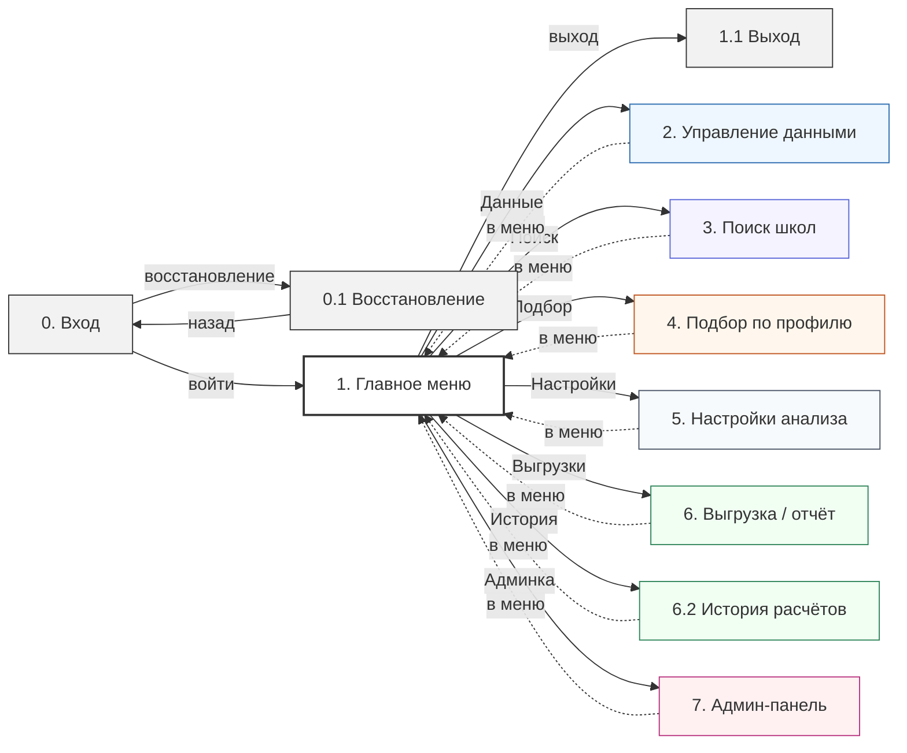
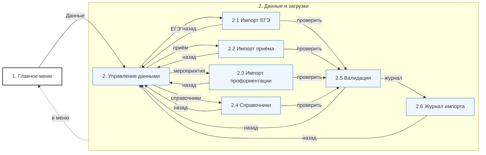
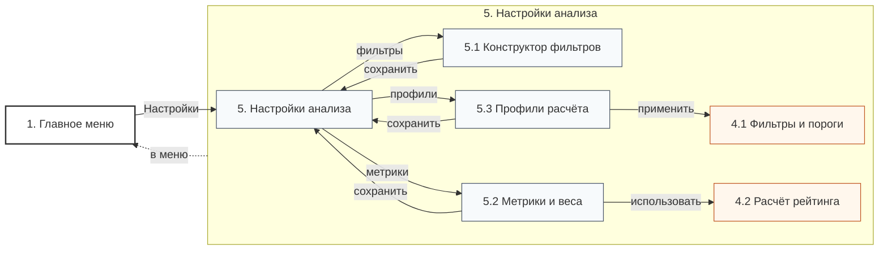
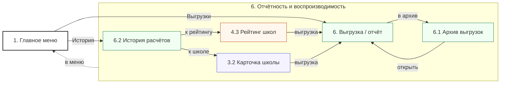
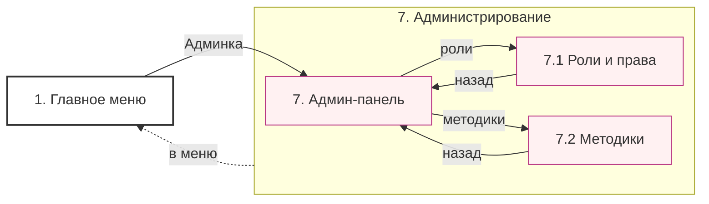

# Диаграмма переходов: вход, восстановление доступа и главное меню

---

# Диаграмма переходов в разделе «Данные и загрузки»

---

# Диаграмма переходов в разделе «Поиск и карточка школы»

```mermaid
---
config:
  layout: dagre
  flowchart:
    nodeSpacing: 15
    rankSpacing: 25
---

flowchart LR
  MainForm["1. Главное меню"]
  ReportGenerate["6. Выгрузка / отчёт"]

  subgraph SEARCH["3. Поиск и карточка школы"]
    direction TB
    SearchForm["3. Поиск школ"]
    CalculationForm["3.1 Расчёт показателей"]
    SchoolCard["3.2 Карточка школы"]

    SearchForm -->|запрос| CalculationForm
    CalculationForm -->|карточка| SchoolCard

    CalculationForm -->|назад| SearchForm
    SchoolCard -->|назад| CalculationForm
  end

  MainForm -->|Поиск| SearchForm
  SchoolCard -->|выгрузка| ReportGenerate
  SEARCH -.->|в меню| MainForm

  %% ====== Стили ======
  classDef auth fill:#f2f2f2,stroke:#333,stroke-width:1px;
  classDef main fill:#ffffff,stroke:#333,stroke-width:2px;
  classDef data fill:#eef7ff,stroke:#2b6cb0,stroke-width:1px;
  classDef search fill:#f5f3ff,stroke:#5a67d8,stroke-width:1px;
  classDef rating fill:#fff7ed,stroke:#c05621,stroke-width:1px;
  classDef set fill:#f7fafc,stroke:#4a5568,stroke-width:1px;
  classDef rep fill:#f1fff3,stroke:#2f855a,stroke-width:1px;
  classDef adm fill:#fff1f2,stroke:#b83280,stroke-width:1px;

  class MainForm main;
  class SearchForm,CalculationForm,SchoolCard search;
  class ReportGenerate rep;
```

---

# Диаграмма переходов в разделе «Подбор и рейтинг школ»

```mermaid
---
config:
  layout: dagre
  flowchart:
    nodeSpacing: 15
    rankSpacing: 25
---

flowchart LR
  MainForm["1. Главное меню"]
  SchoolCard["3.2 Карточка школы"]
  ReportGenerate["6. Выгрузка / отчёт"]

  subgraph RATING["4. Подбор и рейтинг"]
    direction TB
    ProfileSelection["4. Подбор по профилю"]
    ProfileFilterSettings["4.1 Фильтры и пороги"]
    RatingCalculation["4.2 Расчёт рейтинга"]
    RatingList["4.3 Рейтинг школ"]

    ProfileSelection -->|выбрать| ProfileFilterSettings
    ProfileFilterSettings -->|рассчитать| RatingCalculation
    RatingCalculation -->|результат| RatingList

    RatingList -->|карточка| SchoolCard
    RatingList -->|выгрузка| ReportGenerate
    RatingList -->|изменить фильтры| ProfileFilterSettings
    ProfileFilterSettings -->|назад| ProfileSelection
  end

  MainForm -->|Подбор| ProfileSelection
  RATING -.->|в меню| MainForm

  %% ====== Стили ======
  classDef auth fill:#f2f2f2,stroke:#333,stroke-width:1px;
  classDef main fill:#ffffff,stroke:#333,stroke-width:2px;
  classDef data fill:#eef7ff,stroke:#2b6cb0,stroke-width:1px;
  classDef search fill:#f5f3ff,stroke:#5a67d8,stroke-width:1px;
  classDef rating fill:#fff7ed,stroke:#c05621,stroke-width:1px;
  classDef set fill:#f7fafc,stroke:#4a5568,stroke-width:1px;
  classDef rep fill:#f1fff3,stroke:#2f855a,stroke-width:1px;
  classDef adm fill:#fff1f2,stroke:#b83280,stroke-width:1px;

  class MainForm main;
  class ProfileSelection,ProfileFilterSettings,RatingCalculation,RatingList rating;
  class SchoolCard search;
  class ReportGenerate rep;
```

---

# Диаграмма переходов в разделе «Настройки анализа»

---

# Диаграмма переходов в разделе «Отчётность и воспроизводимость»

---

# Диаграмма переходов в разделе «Администрирование»

---

# Диаграмма переходов между экранными формами

```mermaid
--- 
config:
  layout: dagre
  flowchart:
    nodeSpacing: 15
    rankSpacing: 25
---

flowchart LR
  %% ====== Вход и главная навигация ======
  LoginForm["0. Вход"]
  RecoveryForm["0.1 Восстановление"]
  MainForm["1. Главное меню"]
  ExitForm["1.1 Выход"]

  LoginForm -->|войти| MainForm
  LoginForm -->|восстановление| RecoveryForm
  RecoveryForm -->|назад| LoginForm
  MainForm -->|выход| ExitForm


  %% ====== Колоночная раскладка (компактнее) ======
  subgraph COLS[" "]
    direction LR

    subgraph COL1[" "]
      direction TB

      subgraph DATA["2. Данные и загрузки"]
        direction TB
        DataMgmtForm["2. Управление данными"]
        LoadEGE["2.1 Импорт ЕГЭ"]
        Admissions["2.2 Импорт приёма"]
        EventsForm["2.3 Импорт профориентации"]
        Directories["2.4 Справочники"]
        ValidationForm["2.5 Валидация"]
        HistoryForm["2.6 Журнал импорта"]

        DataMgmtForm -->|ЕГЭ| LoadEGE
        DataMgmtForm -->|приём| Admissions
        DataMgmtForm -->|мероприятия| EventsForm
        DataMgmtForm -->|справочники| Directories

        LoadEGE -->|проверить| ValidationForm
        Admissions -->|проверить| ValidationForm
        EventsForm -->|проверить| ValidationForm
        Directories -->|проверить| ValidationForm

        ValidationForm -->|журнал| HistoryForm

        LoadEGE -->|назад| DataMgmtForm
        Admissions -->|назад| DataMgmtForm
        EventsForm -->|назад| DataMgmtForm
        Directories -->|назад| DataMgmtForm
        ValidationForm -->|назад| DataMgmtForm
        HistoryForm -->|назад| DataMgmtForm
      end

      subgraph SEARCH["3. Поиск и карточка школы"]
        direction TB
        SearchForm["3. Поиск школ"]
        CalculationForm["3.1 Расчёт показателей"]
        SchoolCard["3.2 Карточка школы"]

        SearchForm -->|запрос| CalculationForm
        CalculationForm -->|карточка| SchoolCard

        CalculationForm -->|назад| SearchForm
        SchoolCard -->|назад| CalculationForm
      end
    end


    subgraph COL2[" "]
      direction TB

      subgraph RATING["4. Подбор и рейтинг"]
        direction TB
        ProfileSelection["4. Подбор по профилю"]
        ProfileFilterSettings["4.1 Фильтры и пороги"]
        RatingCalculation["4.2 Расчёт рейтинга"]
        RatingList["4.3 Рейтинг школ"]

        ProfileSelection -->|выбрать| ProfileFilterSettings
        ProfileFilterSettings -->|рассчитать| RatingCalculation
        RatingCalculation -->|результат| RatingList

        RatingList -->|карточка| SchoolCard
        RatingList -->|изменить фильтры| ProfileFilterSettings

        ProfileFilterSettings -->|назад| ProfileSelection
      end

      subgraph SETTINGS["5. Настройки анализа"]
        direction TB
        SettingsForm["5. Настройки анализа"]
        GlobalFilters["5.1 Конструктор фильтров"]
        Weights["5.2 Метрики и веса"]
        ProfilesForm["5.3 Профили расчёта"]

        SettingsForm -->|фильтры| GlobalFilters
        SettingsForm -->|метрики| Weights
        SettingsForm -->|профили| ProfilesForm

        GlobalFilters -->|сохранить| SettingsForm
        Weights -->|сохранить| SettingsForm
        ProfilesForm -->|сохранить| SettingsForm

        ProfilesForm -->|применить| ProfileFilterSettings
        Weights -->|использовать| RatingCalculation
      end
    end


    subgraph COL3[" "]
      direction TB

      subgraph REPORTS["6. Отчётность и воспроизводимость"]
        direction TB
        ReportGenerate["6. Выгрузка / отчёт"]
        ReportArchive["6.1 Архив выгрузок"]
        CalcHistory["6.2 История расчётов"]

        SchoolCard -->|выгрузка| ReportGenerate
        RatingList -->|выгрузка| ReportGenerate

        ReportGenerate -->|в архив| ReportArchive
        ReportArchive -->|открыть| ReportGenerate

        CalcHistory -->|к рейтингу| RatingList
        CalcHistory -->|к школе| SchoolCard
      end

      subgraph ADMIN["7. Администрирование"]
        direction TB
        AdminPanel["7. Админ-панель"]
        Roles["7.1 Роли и права"]
        Methodologies["7.2 Методики"]

        AdminPanel -->|роли| Roles
        AdminPanel -->|методики| Methodologies

        Roles -->|назад| AdminPanel
        Methodologies -->|назад| AdminPanel
      end
    end
  end


  %% ====== Переходы из главного меню ======
  MainForm -->|Данные| DataMgmtForm
  MainForm -->|Поиск| SearchForm
  MainForm -->|Подбор| ProfileSelection
  MainForm -->|Настройки| SettingsForm
  MainForm -->|Выгрузки| ReportGenerate
  MainForm -->|История| CalcHistory
  MainForm -->|Админка| AdminPanel


  %% ====== Возврат в меню ======
  DATA -.->|в меню| MainForm
  SEARCH -.->|в меню| MainForm
  RATING -.->|в меню| MainForm
  SETTINGS -.->|в меню| MainForm
  REPORTS -.->|в меню| MainForm
  ADMIN -.->|в меню| MainForm


  %% ====== Скрыть рамки служебных колонок ======
  style COLS fill:transparent,stroke:transparent
  style COL1 fill:transparent,stroke:transparent
  style COL2 fill:transparent,stroke:transparent
  style COL3 fill:transparent,stroke:transparent


  %% ====== Стили ======
  classDef auth fill:#f2f2f2,stroke:#333,stroke-width:1px;
  classDef main fill:#ffffff,stroke:#333,stroke-width:2px;
  classDef data fill:#eef7ff,stroke:#2b6cb0,stroke-width:1px;
  classDef search fill:#f5f3ff,stroke:#5a67d8,stroke-width:1px;
  classDef rating fill:#fff7ed,stroke:#c05621,stroke-width:1px;
  classDef set fill:#f7fafc,stroke:#4a5568,stroke-width:1px;
  classDef rep fill:#f1fff3,stroke:#2f855a,stroke-width:1px;
  classDef adm fill:#fff1f2,stroke:#b83280,stroke-width:1px;

  class LoginForm,RecoveryForm,ExitForm auth;
  class MainForm main;

  class DataMgmtForm,LoadEGE,Admissions,EventsForm,Directories,ValidationForm,HistoryForm data;
  class SearchForm,CalculationForm,SchoolCard search;

  class ProfileSelection,ProfileFilterSettings,RatingCalculation,RatingList rating;

  class SettingsForm,GlobalFilters,Weights,ProfilesForm set;

  class ReportGenerate,ReportArchive,CalcHistory rep;

  class AdminPanel,Roles,Methodologies adm;
```

